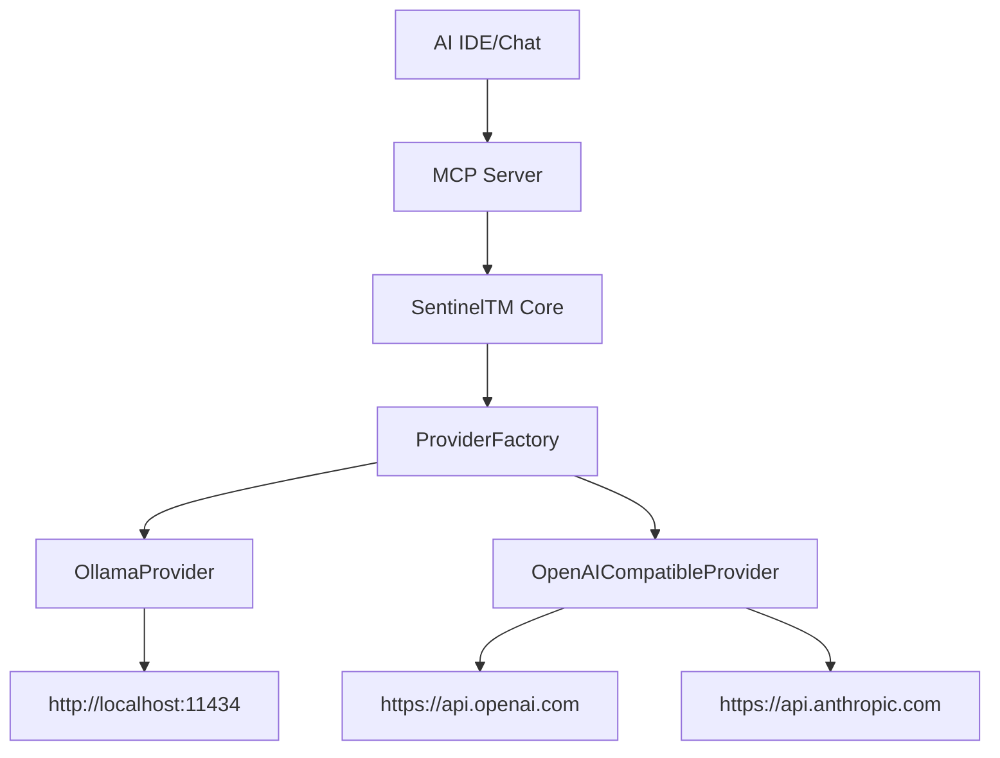

# 🔌 SentinelTM API Integration Guide

## 🚀 Overview

SentinelTM v1.6.0+ uses **API-based providers** instead of CLI tools for better reliability, performance, and user experience.

## 🏗️ Architecture



## 📋 Supported Providers

### 1️⃣ Ollama (Local, Free)
- **Type**: `ollama`
- **Endpoint**: `http://localhost:11434`
- **Authentication**: None required
- **Models**: `llama3`, `codellama`, `mistral`, `phi3`

### 2️⃣ OpenAI
- **Type**: `openai-compatible`
- **Endpoint**: `https://api.openai.com`
- **Authentication**: API Key (`sk-...`)
- **Models**: `gpt-4`, `gpt-3.5-turbo`, `gpt-4-turbo`

### 3️⃣ Anthropic Claude
- **Type**: `openai-compatible`
- **Endpoint**: `https://api.anthropic.com`
- **Authentication**: API Key (`sk-ant-...`)
- **Models**: `claude-3-sonnet-20240229`, `claude-3-haiku-20240307`

### 4️⃣ Google Gemini
- **Type**: `openai-compatible`
- **Endpoint**: `https://generativelanguage.googleapis.com`
- **Authentication**: API Key
- **Models**: `gemini-pro`, `gemini-pro-vision`

## ⚙️ Configuration Schema

### Global Config: `.sentineltm/config/config.json`

```json
{
  "defaults": {
    "provider": "ollama",
    "model": "llama3"
  },
  "providers": {
    "ollama": {
      "type": "ollama",
      "baseUrl": "http://localhost:11434"
    },
    "openai": {
      "type": "openai-compatible",
      "baseUrl": "https://api.openai.com",
      "apiKey": "sk-your-key-here"
    },
    "claude": {
      "type": "openai-compatible",
      "baseUrl": "https://api.anthropic.com",
      "apiKey": "sk-ant-your-key"
    }
  }
}
```

### MCP Config: `.windsurf/mcp.json`

```json
{
  "mcpServers": {
    "sentineltm": {
      "command": "node",
      "args": [
        "path/to/sentineltm-cli/dist/cli.js",
        "serve",
        "--mcp-stdio"
      ],
      "env": {}
    }
  },
  "defaults": {
    "provider": "ollama",
    "model": "llama3"
  },
  "providers": {
    "ollama": {
      "type": "ollama",
      "baseUrl": "http://localhost:11434"
    }
  }
}
```

## 🔧 Setup Instructions

### Option 1: Ollama (Recommended for Local Development)

```bash
# 1. Install Ollama
# Visit: https://ollama.ai

# 2. Pull a model
ollama pull llama3

# 3. Configure SentinelTM
st set provider ollama
st set model llama3

# 4. Test
st gate status
```

### Option 2: OpenAI

```bash
# 1. Get API key from https://platform.openai.com/api-keys

# 2. Configure SentinelTM
st set provider openai
st set model gpt-3.5-turbo

# 3. Add API key to config.json
# Edit .sentineltm/config/config.json and add your key

# 4. Test
st gate status
```

### Option 3: Anthropic Claude

```bash
# 1. Get API key from https://console.anthropic.com/

# 2. Configure SentinelTM
st set provider claude
st set model claude-3-sonnet-20240229

# 3. Add API key to config.json

# 4. Test
st gate status
```

## 🧪 Testing & Validation

### Check Provider Status
```bash
st provider detect
st provider status
```

### Test AI Integration
```bash
# This will test the AI Rule Check
st gate status
```

### Debug Issues
```bash
# Check logs
st dashboard report

# Verify config
cat .sentineltm/config/config.json
```

## 🔍 Troubleshooting

### Common Issues

1. **"No provider configured"**
   - Run `st set provider <name>`
   - Check `.sentineltm/config/config.json`

2. **"API key not found"**
   - Add `apiKey` to provider config
   - Ensure key format is correct

3. **"Connection failed"**
   - Check network connectivity
   - Verify endpoint URLs
   - For Ollama: ensure service is running

4. **"AI Rule Check fails"**
   - This is expected if provider is not available
   - Score will be 60/100 instead of 100/100

### Debug Commands

```bash
# Check configuration
st config show

# List available models
st provider list <provider-name>

# Test connection
st provider status
```

## 🔄 Migration from CLI-based (v1.5.x)

### What Changed
- ❌ No more CLI dependency (`qwen`, `gemini`, etc.)
- ✅ Direct HTTP API calls
- ✅ Better error handling
- ✅ No prompt length limits
- ✅ Faster responses

### Migration Steps
1. Update to v1.6.0+: `npm install -g sentineltm-cli@latest`
2. Choose a provider (Ollama recommended)
3. Configure API credentials if needed
4. Test with `st gate status`

## 📊 Performance Comparison

| Aspect | CLI-based (v1.5.x) | API-based (v1.6.0+) |
|--------|-------------------|---------------------|
| Reliability | ❌ Often failed | ✅ Highly reliable |
| Speed | 🐌 Slow | ⚡ Fast |
| Setup | 🔧 Complex | 🎯 Simple |
| Prompt Limits | ❌ Limited | ✅ No limits |
| Error Messages | ❌ Unclear | ✅ Clear |

## 🎯 Best Practices

1. **Use Ollama for development** - Free, fast, local
2. **Use OpenAI/Claude for production** - Higher quality
3. **Keep API keys secure** - Never commit to git
4. **Test after configuration** - Always run `st gate status`
5. **Monitor usage** - Check provider quotas/limits

## 🔮 Future Enhancements

- [ ] Support for more providers (Cohere, Hugging Face)
- [ ] Automatic failover between providers
- [ ] Cost tracking and optimization
- [ ] Custom model fine-tuning integration
- [ ] Streaming responses for real-time feedback
